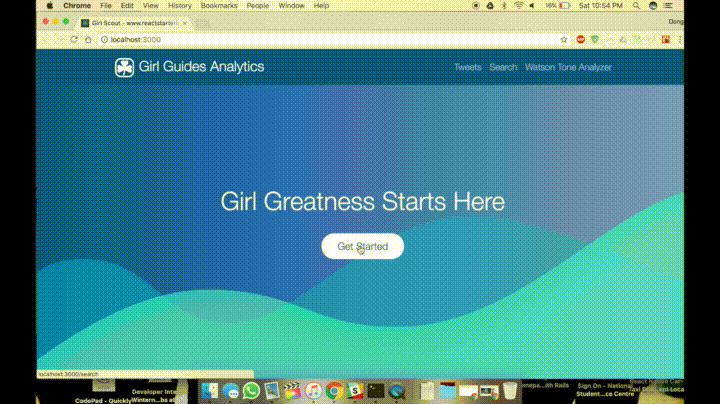

# QTMA Mood Journal

## Team Members
* Shwetha Sivakumar
* Nicholas Chan
* Jeremie Bedard
* Michelle Ye

## Problem statement


## Our solution


## Screenshot



## Requirements

  * Mac OS X, Windows, or Linux
  * [Yarn](https://yarnpkg.com/) package + [Node.js](https://nodejs.org/) v6.5 or newer
  * Text editor or IDE pre-configured with React/JSX/Flow/ESlint ([learn more](./how-to-configure-text-editors.md))

## Directory Layout

Before you start, take a moment to see how the project structure looks like:

```
.
├── /build/                     # The folder for compiled output
├── /docs/                      # Documentation files for the project
├── /node_modules/              # 3rd-party libraries and utilities
├── /public/                    # Static files which are copied into the /build/public folder
├── /src/                       # The source code of the application
│   ├── /components/            # React components
│   ├── /data/                  # GraphQL server schema and data models
│   ├── /routes/                # Page/screen components along with the routing information
│   ├── /client.js              # Client-side startup script
│   ├── /config.js              # Global application settings
│   ├── /server.js              # Server-side startup script
│   └── ...                     # Other core framework modules
├── /test/                      # Unit and end-to-end tests
├── /tools/                     # Build automation scripts and utilities
│   ├── /lib/                   # Library for utility snippets
│   ├── /build.js               # Builds the project from source to output (build) folder
│   ├── /bundle.js              # Bundles the web resources into package(s) through Webpack
│   ├── /clean.js               # Cleans up the output (build) folder
│   ├── /copy.js                # Copies static files to output (build) folder
│   ├── /deploy.js              # Deploys your web application
│   ├── /postcss.config.js      # Configuration for transforming styles with PostCSS plugins
│   ├── /run.js                 # Helper function for running build automation tasks
│   ├── /runServer.js           # Launches (or restarts) Node.js server
│   ├── /start.js               # Launches the development web server with "live reload"
│   └── /webpack.config.js      # Configurations for client-side and server-side bundles
├── Dockerfile                  # Commands for building a Docker image for production
├── package.json                # The list of 3rd party libraries and utilities
└── yarn.lock                   # Fixed versions of all the dependencies
```

## Quick Start

### 1. Get the latest version

You can start by cloning the latest version of this project on your
local machine by running:

```shell
$ git clone \
      git@github.com:hmeinertrita/MyPlanetGirlGuides.git
$ cd MyPlanetGirlGuides
```

### 2. Run `yarn install`

This will install both run-time project dependencies and developer tools listed
in [package.json](../package.json) file.

### 3. Run `yarn start`

This command will build the app from the source files (`/src`) into the output
`/build` folder. As soon as the initial build completes, it will start the
Node.js server (`node build/server.js`) and [Browsersync](https://browsersync.io/)
with [HMR](https://webpack.github.io/docs/hot-module-replacement) on top of it.

> [http://localhost:3000/](http://localhost:3000/) — Node.js server (`build/server.js`)
  with Browsersync and HMR enabled<br>
> [http://localhost:3000/graphql](http://localhost:3000/graphql) — GraphQL server and IDE<br>
> [http://localhost:3001/](http://localhost:3001/) — Browsersync control panel (UI)

Now you can open your web app in a browser, on mobile devices and start
hacking away. Whenever you modify any of the source files inside the `/src` folder,
the module bundler ([Webpack](http://webpack.github.io/)) will recompile the
app on the fly and refresh all the connected browsers.

Note that the `yarn start` command launches the app in `development` mode,
the compiled output files are not optimized and minimized in this case.

## Additional Resources

  * [Getting Started with React.js](http://facebook.github.io/react/)
  * [Getting Started Redux.js](http://redux.js.org/)
  * [About Universal-Router](https://github.com/kriasoft/universal-router)
  * [React.js Questions on StackOverflow](http://stackoverflow.com/questions/tagged/reactjs)
  * [React.js Discussion Board](https://discuss.reactjs.org/)
  * [Flow — A static type checker for JavaScript](http://flowtype.org/)
  * [The Future of React](https://github.com/reactjs/react-future)
  * [Learn ES6](https://babeljs.io/docs/learn-es6/), [ES6 Features](https://github.com/lukehoban/es6features#readme)

--
Based off of the [react-starter-kit](https://github.com/kriasoft/react-starter-kit)

\[rsk]: https://www.reactstarterkit.com
<br>
\[demo]: http://demo.reactstarterkit.com
<br>

## Getting mongodb running locally
1. download mongo https://www.mongodb.com/download-center#community
2. open command line and type in "mongo". If it doesn't open, add the directory mongo is located to your environment variables by going to system settings -> environment variables -> PATH -> new -> "C:\ProgramFiles\MongoDB\Server\3.6\bin"
3. in mongo shell, type "mongo use mood-journal" to set up a database called mood-journal
4. open up another shell and type "mongod", this will get the local server hosting your database running
5. run 'yarn start'and the app should be connected to the database, look for "mongo connection successful" in your code.
